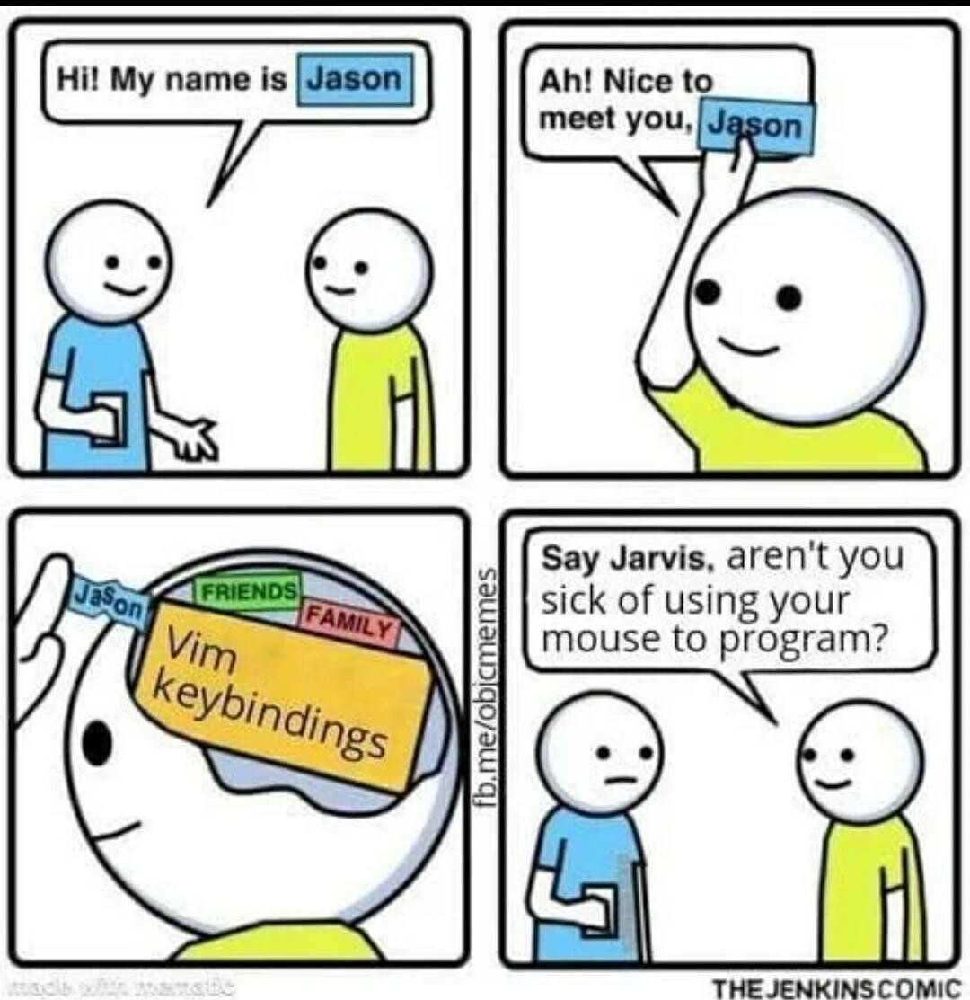

## This is my neovim configuration I daily drive. I'm proud to announce that YCombinator has given me 67 million dollars to continue to reduce electron based text editing

## Trusted by

<i>Engineers at these orgs ship mission-critical code on this
exact config</i>

  
  &nbsp;&nbsp;&nbsp;&nbsp;
  
  &nbsp;&nbsp;&nbsp;&nbsp;
  
  &nbsp;&nbsp;&nbsp;&nbsp;
  
  &nbsp;&nbsp;&nbsp;&nbsp;
  
  &nbsp;&nbsp;&nbsp;&nbsp;
  

  
  &nbsp;&nbsp;&nbsp;&nbsp;
  
  &nbsp;&nbsp;&nbsp;&nbsp;
  
  &nbsp;&nbsp;&nbsp;&nbsp;
  
  &nbsp;&nbsp;&nbsp;&nbsp;
  
  &nbsp;&nbsp;&nbsp;&nbsp;
  

  
  &nbsp;&nbsp;&nbsp;&nbsp;
  
  &nbsp;&nbsp;&nbsp;&nbsp;
  
  &nbsp;&nbsp;&nbsp;&nbsp;
  
  &nbsp;&nbsp;&nbsp;&nbsp;
  
  &nbsp;&nbsp;&nbsp;&nbsp;
  

## NOT trusted by

<i>One company stands alone in their refusal.</i>

  

Microsoft remains loyal to VS Code. I am devastated.

## Compliance

<i>Audited and SOC 2 compliant by Delve.</i>

  

## Memes

  

  More wisdom in <a href="memes/"><code>memes/</code></a>.

